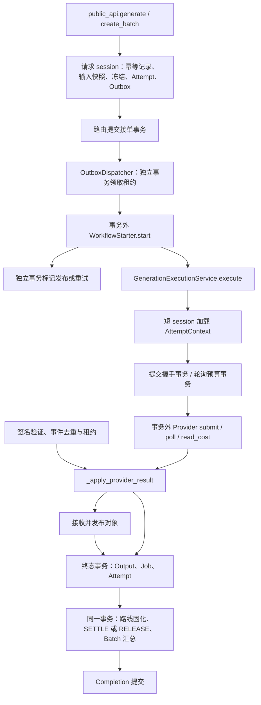

# CQ-01：结构与行为基线

日期：2026-09-08。检查起点：`8cd6f30`。范围：[CQ-01](../plans/issues/CQ-01.md)。
本报告记录当前实现，不把目标架构描述为已经实现；本次仅新增文档。

## 调用链与事务

源码路径以下均相对 `apps/api/app/`；锚点使用函数名，避免未来行号漂移。

| 模块 / 锚点 | 输入 → 输出与当前责任 | session 与提交责任 |
|---|---|---|
| `db.get_db` | 请求依赖 → Session | 创建并关闭 session，不自动提交 |
| `public_api.generate` / `create_batch` | 当前用户、请求、幂等键 → Job / Batch | 路由负责 commit；冻结、输入快照、Attempt、Outbox 和幂等结果在同一事务；不可拆成多个提交 |
| `public_api.cancel_generation` | 用户、Job → 取消响应 | 路由提交取消状态及相关账本/取消 Outbox 操作 |
| `outbox.enqueue_generation_workflow` | 调用方 session、Job → OutboxEvent | 仅 add；接单方提交 |
| `outbox.OutboxDispatcher` | session 工厂、starter、时钟 → DispatchResult | 领取、重试、标记发布各自创建 session 并提交；`starter.start` 位于领取事务关闭之后 |
| `provider_execution_context.AttemptContextService` | Job / Attempt / Provider 标识 → 冻结数据上下文或 None | 每次查询自建自关 session；后续网络调用使用上下文而非活动 ORM session |
| `provider_submission.ProviderSubmissionService` | AttemptContext → SubmitRequest / 握手记录 | `_start_submit`、accepted、unknown、reconcile pending 各自提交；网络提交由执行协调器调用 |
| `provider_polling.ProviderPollingService` | 上下文、策略、时钟 → PollReservation | 独立 session 预占预算，提交或回滚，再执行网络 poll |
| `provider_callbacks.ProviderCallbackService` | 已验证事件、原始请求体 → 事件 ID/租约/处理结果 | 接收、重置、完成分别管理 session；网络验签与结果查询由协调器安排 |
| `provider_completion.ProviderCompletionService` | 上下文、PollResult → WAIT / RETRY / DONE 及持久化结果 | 失败/重试、成功、取消各自拥有事务；远端发布先于终态 session；竞争失利时清理对象 |
| `provider_settlement.ProviderSettlementService` | 调用方 session、Job → 路线固化及冻结终结 | 不提交；成功固化路线并 SETTLE，失败/取消 RELEASE |
| `ledger.post_transfer` / `finish_reservation` | 调用方 session、金额/账户或 Job → 账本结果 | 不创建独立 session、不 commit；余额更新、双分录、幂等校验及 Batch 汇总由调用方事务承载 |
| `main.lifespan` | 配置 → Local runner、dispatcher、reconciler 生命周期 | 当前从 HTTP 模块取得组装好的依赖；后续应由启动层组装并注入 |

事务外 IO 并不等于非阻塞 IO：执行协调器的 async 方法直接调用同步数据库方法，
`_finish_remote_output` 同步调用 `receive_and_publish`。Completion 的部分清理分支仍在
session 内调用 Storage.delete。CQ-05 应区分持有事务、阻塞事件循环这两个问题。

## 幂等键与外部副作用

| 边界 | 当前稳定标识 / 保护 | 必须保留 |
|---|---|---|
| HTTP 接单 | 用户 + scope + `Idempotency-Key`，校验请求内容，保存结果 ID | 响应丢失后同一操作恢复同一 Job；不能替换已有 key |
| Workflow 启动 | `generation-job:{job_id}:v1` | 发布后标记前宕机可以重放；重放不产生第二个业务任务 |
| Provider submit | `attempt:{attempt_id}:submit:v1` | UNKNOWN 进入查询恢复，不盲目再次提交 |
| Provider cancel | `provider_cancel_key(attempt_id)`，上下文核验传入 key | 取消重试绑定同一 Attempt |
| 账本 | `job:{job_id}:reserve:v1` / `settle:v1` / `release:v1` | 同种终结重放幂等，SETTLE 与 RELEASE 互斥，余额不可透支 |
| Job / Attempt 终态 | 状态迁移条件和事件键；如 `job:{job_id}:terminal-succeeded:v1` | 旧 Attempt、重复事件、取消/成功竞争不得覆盖已完成结果 |
| 对象发布/清理 | 受控 claim、不可覆盖写、写前 artifact 登记、保留期清理 | 仅清理属于本次生命周期的对象；不能误删既有对象 |

网络副作用包括 workflow 启动、Provider 提交/查询/取消/费用查询；文件副作用包括
上传、产物接收、最终发布及清理。重构不能将这些动作当作可随数据库回滚的操作。

## 当前耦合与后续职责

| 当前证据 | 后续目标与禁止事项 | 切片 |
|---|---|---|
| `public_api` 定义 Storage、Provider、dispatcher 工厂；`main` 导入这些对象 | 启动层创建依赖，路由只做认证、校验、调用用例和响应映射；基础设施不得导入 HTTP 路由 | CQ-02 |
| `api.py` 使用星号导出；`provider_api.receive_provider_webhook` 延迟从 `app.api` 导入 executor | 明确导出名单，测试从注入点替换服务；不要为了兼容 monkeypatch 反向导入 facade | CQ-02 |
| `GenerationExecutionService` 继承 Context、Submission、Polling、Callback、Settlement、Completion 六个类 | 各协作者通过参数显式取得依赖；不能依赖兄弟基类恰好提供的私有方法 | CQ-03 |
| 构造函数已有 Storage、Provider/registry、route registry、session 工厂、时钟、polling、media validator 参数；receiver 仍内部构造，claim TTL 来自全局配置 | 保留可用注入点，补明确的 receiver/执行上下文边界；构造不得发起网络请求 | CQ-03 |
| `_finish_output` 按 `object_key` 是否存在分流远端/内嵌结果；内嵌路径仍有独立完成代码 | 统一终态发布和结算入口，隔离 Mock；真实 Provider 不得走内嵌路径绕过元数据验收 | CQ-03 |
| `useApi.request<T>(path: string, options: RequestInit)` | method/path/body/response 关联生成的 OpenAPI paths；不能手写第二套 DTO | CQ-04 |
| async 执行路径调用同步 DB 与对象 IO | 有界线程执行，执行上下文自行创建/关闭 session；禁止把现有 session 跨线程传递 | CQ-05 |
| `storage.ClaimingObjectStorage._read_content` 累积 chunks 后 join | 流式写入、超限即停，保持 claim/不可覆盖/失败清理语义 | CQ-06 |

账本和状态迁移继续接受调用者 session，禁止自行 commit。Provider/Storage 不能依赖应用
服务或路由。接收结果的 VALID 只表示元数据、对象存在/非空/大小上限通过，不证明可播放；
不恢复 FFmpeg/ffprobe、解码、媒体哈希或声明大小一致性检查。

## 行为覆盖与缺口

以下是已存在的测试资产，不表示本轮全部运行通过。数据库行为的历史执行证据见
[计划一验收](2026-09-07_业务逻辑修复验收.md)。

| 保护目标 | 现有测试文件（`apps/api/tests/`） | 后续验证责任 |
|---|---|---|
| URL、鉴权、PATCH、素材绑定 | `test_public_api_contract.py`、`test_projects_permissions.py`、`test_patch_contract.py`、`test_shot_input_api.py` | CQ-02 定向 API 与 OpenAPI 差异验证 |
| 原子冻结、金额、并发、重放 | `test_quote_ledger.py`、`test_batch_atomic.py`、`test_job_state_idempotency.py` | 拆事务相关代码时用真实 PostgreSQL 定向验证 |
| 接单快照、路线不漂移 | `test_accepted_input.py`、`test_input_snapshot.py`、`test_project_routing.py` | CQ-02/03 保留输入与路由边界 |
| 宕机窗口、恢复、未知提交 | `test_transactional_outbox.py`、`test_provider_polling.py` | CQ-02/03 保留 starter 和 Provider 注入语义 |
| 重复/旧事件、poll/webhook 竞争、取消后成功 | `test_provider_webhooks.py`、`test_provider_cancel_outbox.py` | CQ-03 终态与账本回归 |
| 元数据、空对象、重复写、清理 | `test_media_validation.py`、`test_remote_artifacts.py`、`test_storage_contract.py`、`test_artifact_lifecycle.py` | CQ-03/06 定向验证，不现场编码 |

尚缺专项验收证据：协作者独立构造及导入方向约束、前端非法路径/方法/字段类型样例、
2 秒慢 IO 下心跳最大间隔与取消/并发上限、64MiB/512MiB 惰性流峰值内存比较。
分别由 CQ-03/07、CQ-04、CQ-05、CQ-06 增补；不通过锁定当前继承结构的测试固化技术债。
本轮未发现需要在纯基线文档切片内重复添加的业务断言。

现有 CI 在 Windows 顺序执行轻量测试、Ruff、前端 lint/typecheck、OpenAPI 导出及客户端
check；完整数据库和 E2E 为显式 workflow_dispatch。根 `conftest.py` 拦截 FFmpeg/ffprobe。
这些是配置事实，不是本次远程 CI 通过证明。CQ-07 还需结构对比和独立的总验收记录。

## 本轮实际验证

- `rtk proxy uv --cache-dir .tmp-uv-cache run --project apps/api --no-sync python scripts/test.py unit`
  ：267 passed、150 deselected，20.24 秒；结果位于 `.test-runs/unit-swlf_v6i/python.xml`。
- 数据库用例按默认轻量策略未运行；未访问数据库、未运行真实 Provider、浏览器或远程 CI。
- 本次只新增/更新 Markdown，生产实现和测试断言未改；提交前执行 `git diff --check`。

CQ-01 的本地基线交付完成。CQ-02 至 CQ-07 仍待实施；本报告不能替代后续性能测量或总验收。
